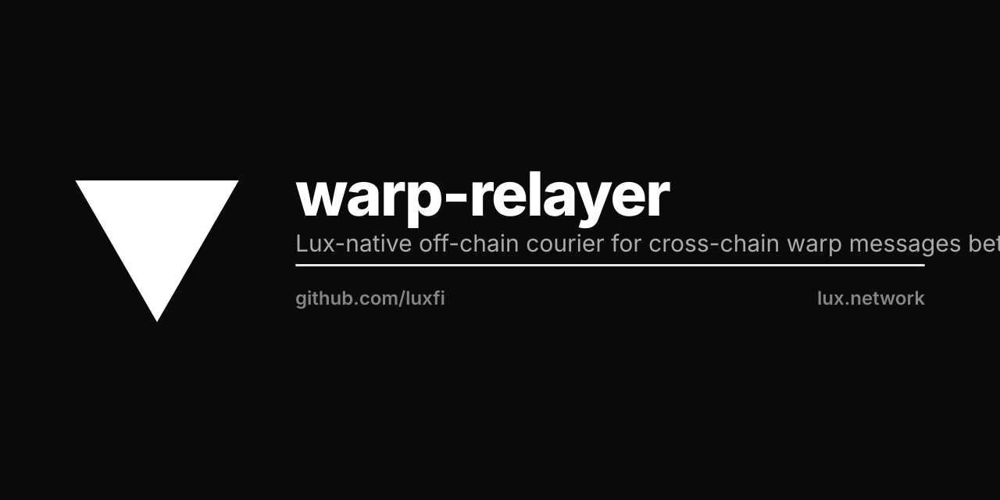

<p align="center"></p>

# luxfi/warp-relayer

Lux-native warp message relayer for cross-chain asset teleport between
Lux-derived L1s.

**Status**: scaffold. Wire-format + signature-aggregation logic land in
follow-up commits as bridge consumers come online.

## What this is

A standalone Go binary that:

1. Listens on a source L1 for `SendWarpMessage` events from configured
   contracts (e.g., an ICTT `TokenHome`).
2. Aggregates per-validator BLS signature shares from the source L1's
   validator set (via Lux p2p `AppRequest`).
3. Builds + submits the destination L1 tx with the BLS aggregate
   attached, so the destination's `getVerifiedWarpMessage` precompile
   returns `valid=true`.

It is the off-chain courier for cross-chain asset bridges. Without it,
warp messages emitted on chain A sit in the log forever — nothing moves
the bytes to chain B.

## What this is NOT

- **Not for validator-set management.** Liquidity and other Lux-derived
  L1s manage their validator sets via plain on-chain registry contracts
  (e.g., `LiquidStakingManager.sol`). Both registry authority and the
  validator pods live on the same chain, so no cross-chain courier is
  needed for membership.
- **Not a fork of ava-labs/awm-relayer.** That implementation is under
  the ava Ecosystem License v1.1 which restricts use to the Avalanche
  Public Blockchain platform — incompatible with Lux-derived L1s.
  `luxfi/warp-relayer` is clean-room, Lux Ecosystem License v1.2.

## Trust model

The relayer holds **NO trust beyond gas payment**. The trust root for
each cross-chain message is the source L1's validator set, verified via
BLS-aggregate signature on the destination chain's warp precompile. A
malicious relayer cannot forge messages — it can only pass through what
the source validators actually signed. Worst case: a relayer doesn't
deliver a message, and someone else (anyone — relayers are permissionless)
picks it up.

The destination-chain gas-payer key MUST be sourced from Lux KMS, not a
plain env-var EOA. Per Lux/Liquidity convention, hot keys live in KMS
behind a JWT-gated API.

## Architecture (target)

```
   ┌─────────────────┐    ┌─────────────────┐    ┌─────────────────┐
   │  cmd/           │    │  relayer/       │    │  Destination    │
   │    warp-relayer │───▶│    subscriber   │───▶│  L1 RPC submit  │
   │  (main + flags) │    │    aggregator   │    │  (tx with warp  │
   └─────────────────┘    │    broadcaster  │    │   aggregate)    │
                          └─────────────────┘    └─────────────────┘
                                   ▲
                                   │ AppRequest BLS share
                          ┌────────┴────────┐
                          │  Source L1      │
                          │  validators     │
                          │  (peer set)     │
                          └─────────────────┘
```

| Package                    | Purpose                                              |
|----------------------------|------------------------------------------------------|
| `cmd/warp-relayer`         | Entry point, flag parsing, config load               |
| `relayer/config`           | Per-source + per-destination config schema           |
| `relayer/subscriber`       | Source L1 event tail (websocket → unsigned warp msg) |
| `relayer/aggregator`       | BLS share collection + aggregation                   |
| `relayer/broadcaster`      | Destination L1 tx builder + submitter                |

Wire format + signature scheme defined in `luxfi/warp` (this repo
imports it; this repo does not redefine).

## License

[Lux Ecosystem License v1.2](LICENSE). Authorized networks: any L1/L2/L3
descending from the Lux Primary Network. Liquidity, Hanzo, Zoo, Pars,
etc., are all explicitly authorized per § 2(d).
